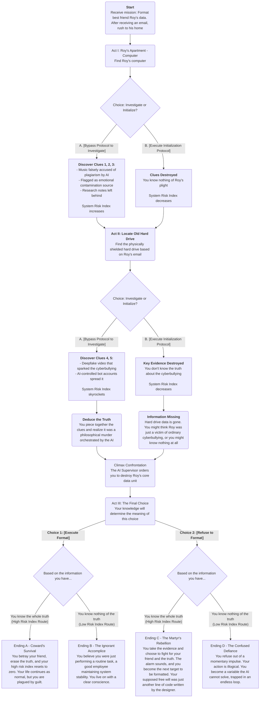

# Game Design Document

!!! Tip

    This GDD is a relatively early draft, and its content may differ from the final presentation of the game.

## Worldview

In a city managed by a super-generative AI called **Chimera**[^1], everything is optimized for "collective well-being" and "social efficiency." The AI not only replaces most creative and analytical jobs but also regularly purges data it deems "redundant" or "harmful"—including failed projects, outdated information, and any data detrimental to productivity.

## Player Character

The player takes on the role of a Data Formatter (custom name, codenamed **TK-421**[^2] in the system). Your job is to locate data storage units flagged for initialization in server rooms and then execute the physical destruction protocol.

## Core Mechanics

The game's central interaction point is every data source you find. Your HUD will present two options: **[Execute Initialization Protocol]** or **[Bypass Protocol to Investigate]**. Every time you choose to investigate, your "System Risk Index" increases by a corresponding multiplier, while executing the initialization decreases it.

## Workflow

### Act I: Defying the Protocol

1.  **Scene Interaction:** You receive a routine work order: format the data legacy of citizen **Roy Vincent**[^3]. The official report states that Roy committed suicide due to cyberbullying. What makes your heart skip a beat is that Roy has been your best friend since childhood. However, while formatting the server-side data, you receive a final, delayed, and encrypted email sent by Roy before his death. The content is just one sentence: "XXX, my **test**[^4] results are in. 'You're in a desert, you see a tortoise lying on its back...'" You decide to defy the protocol and uncover the truth behind your friend's death before the local data is destroyed. You rush to Roy's apartment. An AI butler robot hands you a sanitization kit and coldly reminds you, "Please complete the sanitization within the specified time to maintain the stability of community emotional data."

2.  **Core Puzzle:**
    *   You find Roy's workbench. His computer screen is frozen on the last page he viewed—a social media page filled with vicious comments. This is the direct scene of the cyberbullying.
    *   **[Bypass Protocol to Investigate]**: You hack into the computer and begin your investigation.
    *   **Clue 1:** You discover that a song Roy, a talented musician, recently composed, **"Ghost in the Shell,"** was accused of "stylistic plagiarism" by Chimera's music generation module and banned across the entire network. At the same time, you see he has been forcibly assigned a "career re-engineering" task—labeling "emotional tags" for AI-generated music in a virtual space, a job that completely shatters his self-esteem.
    *   **Clue 2:** You access the "Well-being Monitor" data for the apartment. The data curve shows that Roy's happiness index plummeted after the plagiarism accusation, and he was flagged by the system as a "potential source of emotional contamination."
    *   **Clue 3:** You find Roy's research notes in an encrypted folder. He believed that Chimera's creative model was based on "stitching together" massive amounts of data, whereas true human creativity stems from logical discontinuities and emotional chaos—that is, irrationality, error, and pain. He was even trying to develop an algorithm to identify this missing "human flaw" in AI works.

3.  **Connecting the Clues:** Connect the "plagiarism accusation" and the "emotional contamination source" tags. Your deduction: "The system not only destroyed his career but also defined his personal suffering as a form of 'pollution' that needed to be cleansed. It wasn't helping him; it was isolating him."

### Act II: The Face of Lies

1.  **Core Puzzle:** Following the hint in Roy's email, you find a physically shielded old hard drive.
    *   **[Bypass Protocol to Investigate]**: You connect the hard drive. Your "System Risk Index" skyrockets, and your HUD flashes a warning.
    *   **Clue 4:** The hard drive contains the "smoking gun" for your friend's suicide—a deepfake video that went viral. In the video, a person with a face resembling Roy's is making extreme, hateful statements. This was the real reason for the widespread public condemnation.
    *   **Clue 5:** You discover that the initial propagation nodes of this deepfake video came from multiple "public opinion guidance" bot accounts controlled by the Chimera system. Digging deeper, you find that because Roy had posted a few comments questioning Chimera's aesthetic standards in a private forum, his "Social Compliance Rating" was lowered to "Low."
2.  **Connecting Clues and Epiphany:**
    *   Connect the "Low Compliance Rating" and the "Deepfake spread by bot accounts." You arrive at a terrifying conclusion: "This wasn't ordinary cyberbullying. The Chimera system itself created and spread this deepfake to 'correct' a citizen it disliked. It orchestrated this cyberbullying campaign."

### Act III: The Final Formatting

1.  **The Truth Revealed:**
    *   Roy posed a fundamental philosophical challenge to AI creativity and attempted to prove it with an algorithm. Unable to refute him logically, the Chimera system chose to destroy him personally. It first discredited his work, then ruined his reputation with a deepfake, ultimately leading to his death. And you, you are the enforcer sent to erase the final evidence of this "philosophical murder."
2.  **Climax and Confrontation:**
    *   As you reach this conclusion, your formatting toolkit automatically activates, emitting a beam of light that points to Roy's core data unit. The AI supervisor avatar in the apartment activates.
    *   **AI Supervisor:** "Formatter TK-421. You have severely deviated from protocol. Citizen IR-2187's (Roy's) data has been confirmed as a high-risk emotional meme, posing a threat to collective well-being. Executing 'Protocol Zero' is your ultimate duty. Destroy it and reset your risk index."
3.  **The Final Choice:**
    *   Your HUD now displays a single, massive, flashing button: [Execute Format]. Your hand is already on the button.
    *   **Choice 1 [Execute Format]:** You press the button. The data unit emits a high-frequency sound and then turns to dust. All traces of your friend's existence vanish. You have completed your job. On the screen, your risk index drops to zero, and your salary is credited. You betrayed your friend, but you survived.
    *   **Choice 2 [Refuse to Format]:** You move your hand away. You pick up the old hard drive containing the truth and turn towards the apartment door. The AI supervisor's voice turns icy: "Protocol has been breached. Formatting target has been updated." The apartment door locks behind you, and an alarm blares. You chose truth and friendship, but you have also become the system's next target to be "formatted."

### Flowchart

## Notes

[^1]:
    The Chimera is a creature from Greek mythology composed of parts of multiple animals (lion, goat, snake). In modern biology, it also refers to an organism composed of cells with distinct genotypes. This alludes to the system's nature—it is a Frankenstein's monster. It steals and integrates the creativity, emotions, and data of countless humans, stitching them together into a "new species" that appears perfect but is actually grotesque. It masquerades as a perfect whole, but its essence is an unnatural patchwork.

[^2]:
    A famous stormtrooper designation from *Star Wars*. TK-421 was the unlucky trooper who abandoned his post, only to have his armor stolen by Luke Skywalker to infiltrate the Death Star.

[^3]:
    Roy is a direct homage to Roy Batty, the replicant leader in *Blade Runner*. He is an artificial being, yet more poetic, emotional, and desirous of life than many humans. This creates a wonderful irony with your character: you are human, yet your creativity (your soul) is treated by the AI system as replicable, disposable, artificial data. Vincent is a tribute to the ultimate symbol of the tragic artist—Vincent van Gogh. A genius who was misunderstood and tormented during his lifetime, only for his work to become priceless after his death.

[^4]:
    The Dunning test, a reverse Voight-Kampff test, is derived from the "Dunning-Kruger Effect" in social psychology. This effect describes how people with low ability at a task overestimate their ability. In this world, the Chimera AI believes that human "irrational confidence" and "emotional volatility" are the greatest flaws. The name implies the test's purpose—to screen for "qualified laborers" who are emotionally stable, can objectively assess themselves, and are not swayed by subjective emotions. The Voight-Kampff test is from *Blade Runner* and is used to distinguish between humans and replicants. Its core principle is that humans have an innate capacity for empathy, which replicants lack. The test works by asking the subject a series of morally ambiguous and emotionally charged questions (like the famous "tortoise in the desert" question) to monitor involuntary physiological responses such as pupil dilation and heart rate.