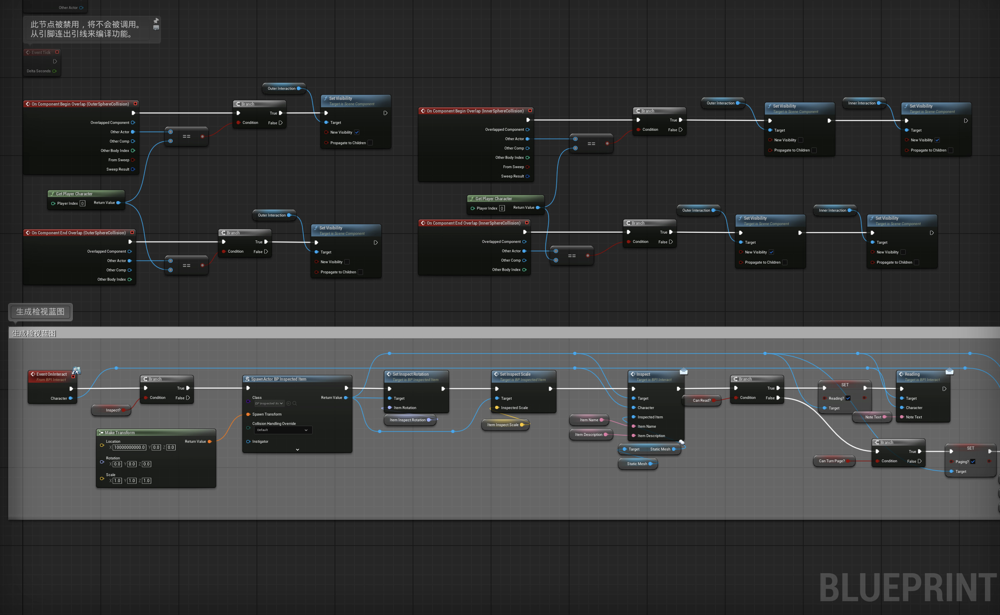
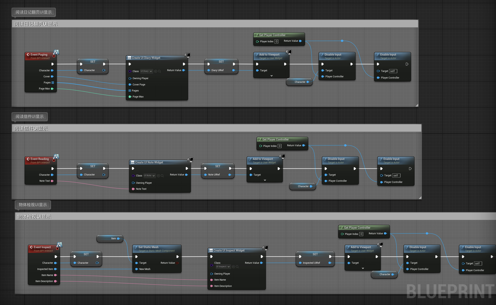
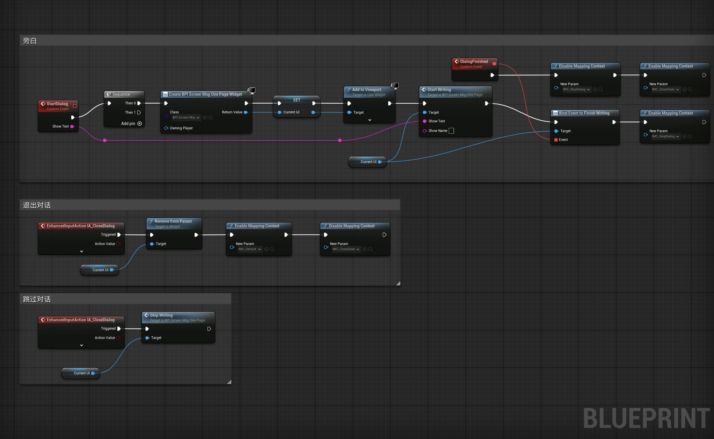
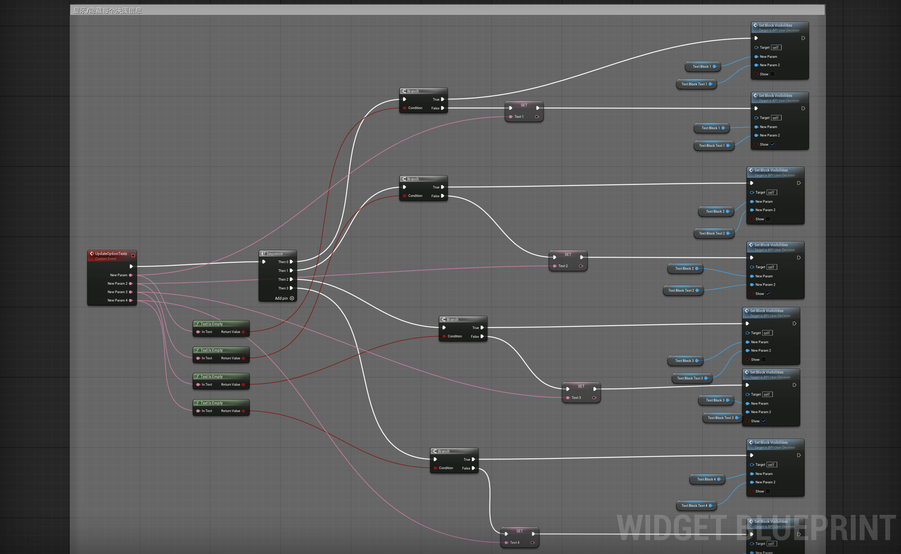

# DELETE ME NOT

## INSPIRATION

My inspiration comes from the explosive development of AI in recent years. AI-generated advertisements and videos have already permeated our lives, and my encounter with the AI detection system while completing my thesis allowed me to experience a cold, machine logic—it only recognizes data patterns but fails to understand human intentions. I can't help but worry about how, in the near future, a society that exists for absolute efficiency will handle "inefficient" human individuals. Therefore, in this project, my team and I hope to develop a game to explore the dialectical relationship between AI and human society.

---

## RESEARCH

### I. The Reshaping of Jobs

The World Economic Forum's (WEF) "Future of Jobs Report 2023" predicts that by 2027, 83 million jobs globally may be displaced by AI and automation, while 69 million new jobs will be created. This results in a net loss of 14 million jobs, or 2% of current employment.

### II. The Exponential Leap of AI

Prediction from market research company Statista: The size of the global AI market is expected to grow from approximately $200 billion in 2023 to over $1.8 trillion by 2030.

### III. Generalization of AI Tools

According to Tyton Partners' "Time for Class 2024: The State of AI in Higher Education" report, nearly 100% of American college students are aware of generative AI tools, with 57% using them weekly or more for academic work. Over two-thirds believe AI is "important" or "very important" for their university education, indicating a shift from tool to dependency.

### IV. The Cage from Algorithms

-   **TikTok**: Its recommendation algorithm is renowned for its astonishing learning speed and accuracy, making it one of the most powerful tools for creating "information bubbles." It not only analyzes your likes and follows but also tracks the duration of each video you watch with millisecond-level precision.
-   **YouTube**: In order to keep you continuously watching, YouTube's algorithm tends to recommend videos similar to those you have just watched, but usually slightly more inflammatory, extreme, or conspiracy theory-laden, as such content has been proven to be much more effective at capturing users' attention.

---

## Design Concept

This is a choice-driven first-person narrative puzzle game. The player portrays a "screw" in a vast system, whose job is to physically destroy data deemed "worthless" or "harmful" by AI—i.e., the digital traces of a deceased person's entire life. When the next task targets their childhood best friend, this routine procedure becomes the ultimate test of conscience and courage.

The core experience of the game revolves around a recurring binary choice: to **[execute purification]** or to **[bypass investigation]**. Choosing to comply will keep you safe, but the truth will be forever buried; choosing to investigate will bring you closer to the truth, but at the same time, the "risk index," representing the surveillance and punishment by the AI system, will skyrocket. This is not only an investigation taking place in a friend's apartment but also a contest of will between the player and the omnipresent AI system.

---

## Case Study

### The Stanley Parable
-   The core of the game is the interaction between the narrator's guidance and the player's choices.
-   The game unfolds entirely based on the player's decisions on simple binary options, each choice leading to different branches and endings.
-   The game breaks the fourth wall, allowing players to deeply reflect on whether "free choice" within the designed framework is real or pre-set.
-   **Takeaway**: It can draw inspiration from the design of narration, making AI a key role. Every choice should give the system clear feedback, thereby strengthening the player's feelings of "defiance" or "submission."

### Papers, Please
-   The core gameplay is the monotonous and tedious paperwork day after day. It is in this mechanical labor that players deeply experience the rigidity and high pressure of the system.
-   The grand story background is pieced together bit by bit through each document, each applicant's small story, and subtle clues.
-   **Takeaway**: The player's task should also be a repetitive protocol mission. The monotony of this work can be highlighted to form a stark contrast with the act of investigating the truth, making each violation by the player filled with a sense of ritual and guilt. It allows players to find connections in the vast amount of data and piece together the truth of their friend's death.

### PORTAL 2
-   The AI (GLaDOS) in Portal gradually reveals its evil and deceitful nature from a seemingly friendly and humorous test guide, and this transformation process is the core charm of the game's narrative.
-   The backstage area of the lab, the scrawled graffiti on the walls ("The cake is a lie"), all silently tell a story that is darker and more real than the "official version."
-   **Takeaway**: Initially, the AI can appear polite and logical, emphasizing that everything is for the "collective happiness." As the player investigates, its words will gradually reveal its true face of hypocrisy, desire for control, and coldness.

---

## Group Members

<table style="border: none;">
  <!-- Haoyang Tao 的区块 -->
  <tr>
    <!-- 左侧图片单元格 -->
    <td style="width: 120px; vertical-align: top; border: none;">
      
    </td>
    <!-- 右侧文字单元格，现在名字和职责都在这里 -->
    <td style="vertical-align: middle; border: none;">
      
<b>Haoyang Tao</b>

      
Logic Design, Flow & Runtime Programing, Scene Production

    </td>
  </tr>

  <!-- Tong Shi 的区块 -->
  <tr>
    <!-- 左侧图片单元格 -->
    <td style="width: 120px; vertical-align: top; border: none;">
      
    </td>
    <!-- 右侧文字单元格 -->
    <td style="vertical-align: middle; border: none;">
      
<b>Tong Shi</b>

      
Assets Design, Scene Design, Animation Production

    </td>
  </tr>
</table>

---

## Storyboard

---

## Blueprints

To implement the game's core gameplay and interactive experience, we designed a modular Blueprint system. This system is centered around the Player Character (FirstPersonCharacter) and communicates with various Interactable Objects (BP_ItemBase) and the User Interface (Widgets) in the scene through a Blueprint Interface. The overall approach is event-driven: player input or actions trigger specific events, which are then handled by the corresponding Blueprints, ultimately providing feedback to the player.

### Core Interaction Logic

Player interaction with the world is achieved through a Line-Trace. The system casts a ray forward from the player's camera position:

Ray Casting and Detection: Using the Line Trace By Channel node, the system continuously detects the object at which the player's crosshair is pointing.
Interface Validation: If the ray hits an object, the system checks if that object implements our interaction interface (BPI_UserDecision). The advantage of this approach is that we avoid the need for casting to every interactable object type, significantly improving the system's scalability and performance.
Triggering Interaction: When the player presses the interact key, the interaction event of the hit object is called. Simultaneously, to provide immediate visual feedback, the object will highlight when the player's crosshair hovers over it.

### Item Interaction & Parent-Child Blueprint Structure

To uniformly manage all interactable items in the scene, we created a parent Blueprint class called BP_ItemBase. All specific items (like diaries, photos, etc.) inherit from this base class.

Common Functionality: In BP_ItemBase, we implement functionalities common to all items, such as highlighting and de-highlighting when targeted by the player's line trace.
Specialized Extension: Specific child Blueprints, such as BP_Inspecteditem, inherit the parent's functionality while adding their own unique interaction logic. For example, when the player interacts with a BP_Inspecteditem, the system generates a UI to display its details, passing the item's name, description, and 3D model to the UI.

For inspectable items, we also designed a complete "pick up/put down" and "rotate/examine" interaction flow:

Pick Up and Put Down: The player can press a key to pick up an item for observation, at which point the item moves to a fixed position in front of the camera. Pressing the key again returns it to its original location.
Rotation and Zoom: In inspection mode, the player can use the mouse to freely rotate the item and the scroll wheel to zoom in and out, allowing for a detailed examination of every aspect of the item.

### Dialogue System & UI Interaction

Dialogue is central to driving the game's narrative. Our dialogue system is tightly integrated with the UI:

Triggering Dialogue: When the player interacts with a specific NPC or item, the StartDialog event is triggered.
UI Generation and Control: This event creates a dialogue UI (BPI_ScreenMsg) and adds it to the viewport. To prevent the player from performing other actions during the dialogue, the system disables player movement and camera rotation and shows the mouse cursor.
Typewriter Effect: To simulate a natural conversation feel, the text is displayed with a typewriter effect. We use the Event Tick and timers to precisely control the interval at which each character appears.
Restoring Control: Once the dialogue ends (either by the player clicking "continue" or the text finishing), the UI is removed from the screen, and game control is returned to the player.

### Game State Management (Pause & Resume)

To provide a better gameplay experience, we designed a simple game pause mechanism:

Triggering Pause: When the player presses the Esc key, the game is paused using the Set Game Paused node.
Displaying Pause Menu: Simultaneously, the system creates a pause menu UI and displays it in the center of the screen, setting the input mode to UI Only so the player can interact with the menu buttons.
Resuming Game: When the player clicks the "Resume" button, the pause menu UI is removed, the game state returns to normal, and the input mode is switched back to Game Only.

### Scene Interactive Elements (Doors)

Doors are a typical interactive element in the scene, and their open/close logic is implemented using a Timeline:

Key Trigger: The player presses a designated key (e.g., "E") to trigger the door's open/close event.
Timeline Animation: We use two separate Timeline nodes to control the door's opening and closing animations. The Timeline smoothly changes the door's rotation over a set period based on a predefined curve, resulting in a fluid animation.
Restricted Access: To create one-way doors or doors that only open at specific story points, we've added a Box Collision trigger. The player can only interact with the door when their character is inside this trigger volume. This not only adds flexibility to level design but also prevents the player from entering certain areas prematurely.
This modular design approach based on Blueprints makes the entire system's logic clear and easy to extend and maintain. Whether we're adding new interactable items or designing more complex level logic, we can iterate efficiently on the existing framework.

---

## Behind the Scene

<iframe width="560" height="315" src="https://www.youtube.com/embed/dWhC4g2ZKLo?si=4VY5pVUUIWCLf0oi" title="YouTube video player" frameborder="0" allow="accelerometer; autoplay; clipboard-write; encrypted-media; gyroscope; picture-in-picture; web-share" referrerpolicy="strict-origin-when-cross-origin" allowfullscreen></iframe>